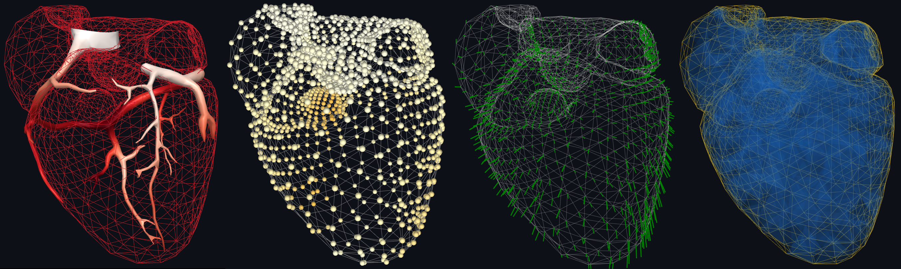

===========
SimExporter
===========

**SimExporter** is a Python module for creating **3D interactive scenes** of various 3D objects using
:K3D:`K3D <>` and exporting a **3D plot** or a **3D animation** in a standalone HTML file.

This HTML file can then be shared and opened in any browsers and laptop, it can also be easily integrated into a website or
presentation slides.

.. image:: _static/gallery.gif

Features
--------

**SimExporter** provides a lightweight, user-friendly API to create 3D objects:

* Create various 3D object types: meshes, points, vectors;
* Associate time series to the 3D objects.

Then, the scene containing the 3D objects can be exported in a standalone HTML file:

* Export a static plot of the 3D objects;
* Export an animation using the time series associated to the 3D objects.

Gallery
-------

Try an integrated animation on our `team website <https://mimesis.inria.fr/>`_ !

.. image:: _static/mimesis_website.gif

.. toctree::
    :hidden:

    Demo        <demo.rst>
    Install     <install.rst>
    How to use  <usage.rst>
    API         <api.rst>
